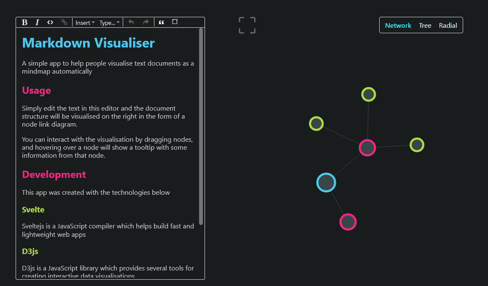
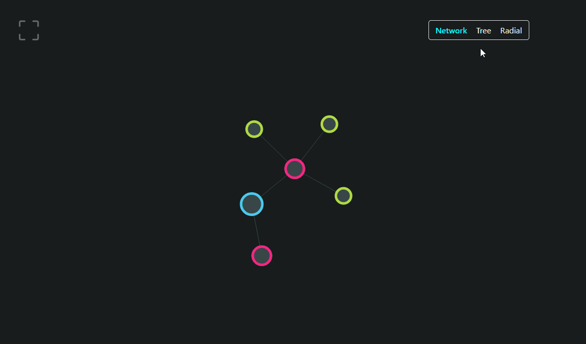

#  md-viz
 
Visualise a Markdown/Rich Text document as an interactive node diagram.
You can view the live version at https://md-viz.netlify.app/


## Features

### Represent the editor content structure as nodes

As shown in the image above, the Headings from the text editor component on the left directly map to nodes in the diagram on the right. Links between nodes are created such that headings will automatically link to lower level headings that appear below them. This is essentially the same tree structure as seen in table of contents sections for documents.

### Node tooltips

Examine the text content of each node on hover.



### Graph type

Switch between different structures of visualisation.

**Network** - Nodes can move freely, according to the link forces, manybody forces, and force towards the center of the graph area.

**Tree** - Nodes are affected by similar forces to the network type, but they are drawn to a y-value corresponding to the depth/level of each node.

**Radial** - Similar to the tree structure, however nodes are instead drawn to a radius from the center depending on their depth/level. This can be useful when the branching factor is large.



## Development

First clone the github repository

```
git clone https://github.com/jw176/md-viz.git
```

Navigate to the project

```
cd md-viz
```

Install the required node dependencies. If node is not installed you can donwload and install it [here](https://nodejs.org/en/)

```
npm install
```

Run the development server

```
npm run dev
```

## Tools used

 - [Svelte](https://svelte.dev/) - The javascript compiler used
 - [D3js](https://d3js.org/) - For interactive and force directed svg data visualisations
 - [ProseMirror](https://prosemirror.net/) - The JavaScript text editor library

## Contributing
Pull requests are welcome. For major changes, please open an issue first to discuss what you would like to change.

## Author
Jack Whelan

You can find me on [LinkedIn](https://www.linkedin.com/in/jack-whelan-1707491aa) 

## License
This project is licensed under the [MIT](LICENSE) License.
